---
output:
  html_document: default
  pdf_document: default
---
# Introduction

In telecommunication systems, it is often important to know how far the bandwidth of a given antenna actually extends.

In this guide, we walk through a simple measurement to determine the bandwidth of a basic monopole antenna using a nanoVNA-F V3 from SYSJOINT. We will evaluate whether the selected antenna is suitable for the 160 m, 80 m, 40 m, 20 m, 10 m, 6 m, 2 m, and 70 cm amateur radio bands. This requires investigating the antenna over a frequency range from 1.81 MHz to 440 MHz. 

**Note**: These frequency ranges are valid in Austria according to the _Frequenznutzungsverordnung_ (FNV), i.e. the Radio Regulations. Please make sure to verify the legal frequency bands in your own country before transmitting.

This guide is intended for anyone who wants to get started with VNA measurements or gain a basic understanding of how to analyze antennas using a VNA. If you are already familiar with the fundamentals, feel free to skip ahead to the measurement section. 

We begin with a brief overview of antenna theory, clarifying key concepts such as impedance matching, S-parameters, characteristic impedance, and SWR. Next, we examine the properties of a common monopole antenna. Finally, we perform a VNA measurement to evaluate how well the antenna performs across the desired frequency bands.

# Fundamental Theory

## A typic monopol Antenna

A monopole antenna can be viewed as one half of a dipole antenna mounted above a ground plane. Assuming an ideal ground plane of infinite extent, the radiation pattern in the upper hemisphere is identical to that of a full dipole antenna.

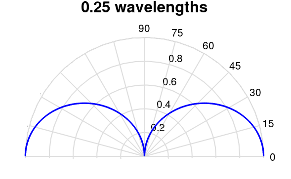

(https://en.wikipedia.org/wiki/Monopole_antenna#/media/File:Monopole_radiation_pattern_0.25_wavelength.png)

Similar to a dipole antenna, a monopole antenna transmits and receives most efficiently in directions perpendicular to its length. Due to the presence of the ground plane, the total radiated power is half that of a dipole antenna, while the radiation in the upper hemisphere remains comparable.

$$
P_{monopole} = \dfrac{1}{2} P_{dipole}
$$

On the other hand, the directivity doubles:

$$
D_{monopole} = 2D_{dipole}
$$

Whip antennas are a type of monopole antenna that operate without a dedicated ground plane and exhibit a more omnidirectional, doughnut-shaped radiation pattern. In this guide, we focus on the quarter-wave monopole antenna, whose physical length is approximately $\lambda/4$. While monopole antennas can be designed for other wavelength fractions, the quarter-wave configuration is by far the most common. For low frequencies ~1MHz in the 300m band and AM transmitting antennas the length has to be large $\lambda/4 = 75m$. 

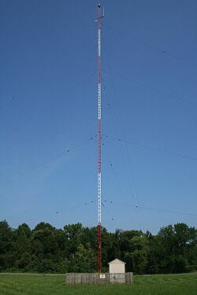

(https://en.wikipedia.org/wiki/Mast_radiator#/media/File:2008-07-28_Mast_radiator.jpg)

For the desired Amature radio bands we therfor get the followning requierd lengts

| f-band    | f-range |  requiered monopole length ($\lambda/4$)|
| -------- | ------- | ------- |
| 160m     | 1810-1850 kHz     | 40m |
| 80m      | 3500-3800 kHz     | 20m |
| 40m      | 7000-7200 kHz     | 10m |
| 20m      | 14000-14350 kHz   | 5m |
| 10m      | 28000-29700 kHz   | 2.5m |
| 6m       | 50,0-50,5 MHz     | 1.5m |
| 2m       | 144-146 MHz       | 50cm |
| 70cm     | 430-439,1 MHz     | 17.5cm |

**Only f-bands with primary use are considered 

The table above provides an overview of the approximate antenna lengths required for each frequency band. It already becomes clear that, with a generic monopole antenna, meaningful operation is limited to the 2 m and 70 cm bands. For the remaining bands, the antenna is simply too short to operate efficiently.

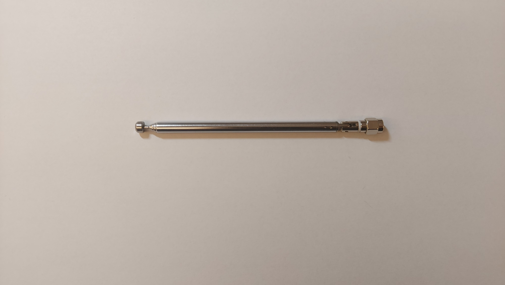

For this experiment, we will use the whip antenna shown in the figure above. While we can quickly estimate the required antenna length, its exact electrical characteristics are not yet known. To determine these, we first need to clarify some fundamental concepts, which are covered in the next section.

## Maximum Power Transfere

Whenever we work with antennas, our goal is to transfer as much energy as possible from the signal source into electromagnetic waves via the transmitting antenna or, conversely, to capture as much energy as possible from the received waves into our measurement device via the receiving antenna.

The assumption is that every power source no matter how well it is build has an internal parasitic resistance $R_{in}$ the AC source is then connected to a load $R_L$.

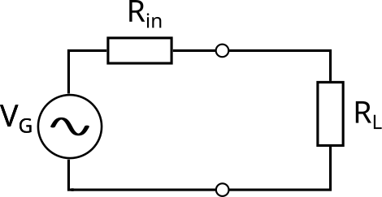

In this simple circuit network we can express the peak current $\hat{I}$ as 

$$
\hat{I} = \dfrac{\hat{V}_s}{R_{in} + R_L}
$$

where $\hat{V}_s$ is the peak voltage. Assuming our source generates an ideal sinosiodial function at a arbitrary frequency we calculate the power at the load with the root *mean square value* (RMS) of $\hat{I}$, which means $I_{RMS} = \frac{\hat{I}}{\sqrt{2}}$ .

$$
P_L = I_{RMS}^{2} \cdot R_L = \dfrac{1}{2} \cdot \dfrac{\hat{V}_s^{2}R_L}{(R_{in} + R_{L})²}
$$

$P_L$ maximizes when $R_{in}$ is exaclty $R_L$. 

$$
R_{in} = R_L
$$

we can repeat this investigation with complex load and internal impedance $Z_{in}$ and $Z_L$ and we will find that in this case the real part of complex impedances fullfiles the condition above and the imaginary part cancel each other out $X_{in} = X_L$. That means the maximum power transfere consdidering impedances is 

$$
Z_{in} = Z_L^*
$$

The key takeaway is that, due to the antenna’s input impedance $Z_{in}$ we can not transfere all power from the source to the load $Z_L$, but what we can adjust $Z_{in}$ so that it matches a desired resistance, optimizing the power transfer.

### Caracteristic Impedance 

Typically, an antenna is not connected directly to the signal source. Instead, a transmission line carries the signal from the source to the antenna feed. The electrical properties of a transmission line are described by its **characteristic impedance**, $Z_0$.

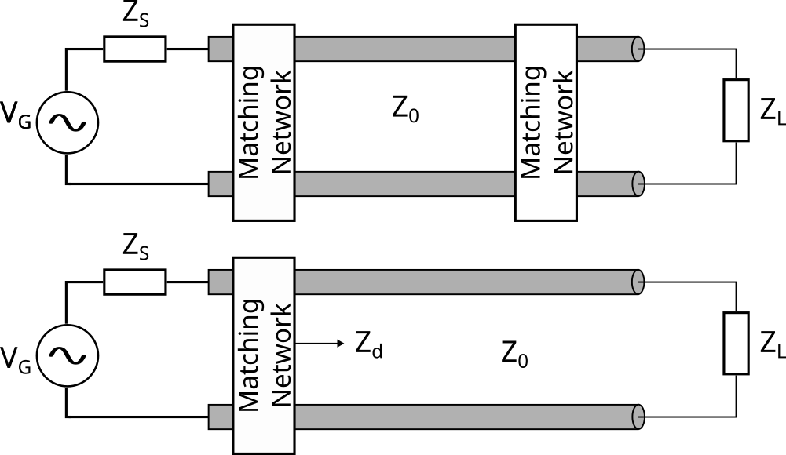

Again, our goal is to transfer as much power as possible from the source, through the transmission line, to the antenna or vice versa. To achieve this, we use matching networks, which can be designed to accomplish one of the following:

+ Reflectionless matching:
	Both the generator and the the load are matched so that effectively, $Z_S = Z_L = Z_0$
	Here the maximum power is transfered to the load.

+ Conjugate complex matching:
	In this case the load is connected to the transmission line without a matching network. Only the generator is conjugate-matched to the input impedance of the line $Z_d$, $Z_d = Z_S^*$, where $Z_d \neq Z_0$. 

_Conjugate complex matching_ is not exactly the same as _reflectionless matching_ , which refers to matching the load to the line impedance. That means, if we now attach an antenna to the source  it now "sees" an input resistance that is a compination of both $Z_L$ and and $Z_0$, hence $Z_d$. 

There is much more to discuss about matching, but this topic is beyond the scope of this guide we’ll cover more exciting matching concepts at another time. For now, the important point is that, from a circuit theory perspective, a transmission line can be represented by lumped circuit elements to form an electrical equivalent circuit, which looks like this:

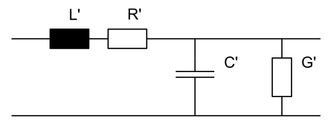

Where $L'$ is the inductive, $C'$ the cpacitive property and $R'$  and the conductance $G'$ are the losses of the transmisstion line. Consecuently, if we talk in about a transmission line without losses we refere to the circuit below.

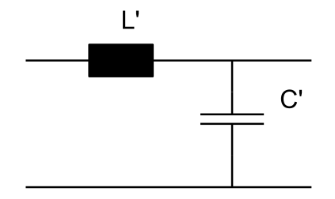

The cracteristic impedance $Z_0$ of a transmission line with losses is then defined as such

$$
Z_0 = \sqrt{\dfrac{R'+j\omega L'}{G' + j\omega C'}}
$$

and without losses

$$
Z_0 = \sqrt{\dfrac{L'}{C'}}
$$

**So we can think of $Z_0$ as the impedance requiered so that the voltage and current waves propagate without reflection.** The most common value for $Z_0$ is $50 \Omega$, but this do not have to be the case. 

**Please Note** : The concept of $Z_0$ is fairly intuitive, but its derivation is somewhat more involved. In everyday engineering practice, however, it is usually sufficient to rely on the definitions provided above.

## S - Parameters & SWR

### The S-Parameters

Electrical circuits are often most effectively analyzed as **two-port networks**. In many cases, we may not know exactly how a circuit or antenna will behave under different conditions, such as varying frequencies. A common way to study the circuit’s behavior is to measure how much of an incoming wave is reflected or transmitted at the circuit’s ports. For a two-port network, we distinguish between the **incident waves** $a$ entering the circuit and the **reflected (or outgoing) waves** $b$ on port 1 and 2 for a two port network. 

The S-Parameters are the defiend by the incident and outgoing waves:

$$
S_{mn} = \dfrac{V_{out, m}}{V_{in, n}} \quad \text{or} \quad S_{11} = \dfrac{b_1}{a_1} \Big|_{a_2 =0} \ S_{21} = \dfrac{b_2}{a_1} \Big|_{a_2 =0} \ S_{12} = \dfrac{b_1}{a_2} \Big|_{a_1 =0} \ S_{22} = \dfrac{b_2}{a_2} \Big|_{a_1 =0} 
$$

summerized in 

$$
\begin{bmatrix}
b_1 \\
b_2 
\end{bmatrix}
=
\begin{bmatrix}
S_{11} & S_{12}\\
S_{21} & S_{22}
\end{bmatrix}
\begin{bmatrix}
a_1 \\
a_2 
\end{bmatrix}
$$

We can calculate the follwoing important quantities from the S-parameters:

The **Return Loss**:

$$
RL = -20 \cdot \text{log}_{10}(|S_{11}|)
$$

The **Insertion Loss**:

$$
IL = -20 \cdot \text{log}_{10}(|S_{21}|)
$$

These S-parameters are important, because they are exactly what VNAs are measureing. Our monopol antenna actually has only one input that we can examine. So basically, we will only be able to measure $S_{11}$. 

### The reflection coefcient 

Here is the intresting part: There is a quantity called the reflection coeficient $\Gamma$ that is defined as the ratio of the reflected wave to the incident wave 

$$
\Gamma = \dfrac{V_{ref}}{V_{fwd}}
$$

If you read the previous section, you may notice that this definition sounds very similar to that of the S-parameters. Indeed, the reflection coefficient is exactly the same as $S_{11}$.

$$
\Gamma = S_{11} \quad \text{hence} \quad RL = -20 \cdot \text{log}_{10}(|\Gamma|)
$$

we can also calculated RL in terms of power with the *power reflection coefficient* $\rho = |\Gamma|²$ 

$$
RL = -10 \cdot \text{log}_{10}(|\Gamma|²)
$$

$\Gamma$ basically tells us how well matched a load is to its connected source. For passive load impedances the, the absolute value of the reflection coefficient varies from -1 to +1. $\Gamma = 0$ indicates a perfect match. $\Gamma = -1$ indicates a short circuit. $\Gamma = +1$ indicates an open circuit. 

From $\Gamma$ we can acually calculate the load impidance $Z_L$ that is connected to the source. 

$$
\Gamma = \dfrac{Z_L - Z_0}{Z_L + Z_0} 
$$

if we assume that $Z_0 = 50 \Omega$ we only have to solve for the unknown $Z_L$. 

$$
Z_L = Z_0 \cdot \dfrac{1 + \Gamma }{1 - \Gamma}
$$

Furthermore, the degree of mismatch can be quantified by examining the ratio between the maximum and minimum peaks of a standing wave along a transmission line. This quantity is called the **Standing Wave Ratio (SWR)**. When measured in terms of voltage, it is sometimes referred to as the **Voltage Standing Wave Ratio (VSWR)**. Conveniently, the SWR can also be calculated directly from the reflection coefficient $\Gamma$:

$$
VSWR = \dfrac{V_{max}}{V_{min}} = \dfrac{1 + |\Gamma|}{1 - |\Gamma|}
$$

The main takeaway is that by measuring $S_{11}$, we can calculate a variety of other important quantities, such as the reflection coefficient $\Gamma$, the load impedance $Z_L$, the return loss $RL$, and the SWR. Essentially, all of these measurements describe the same underlying property of the circuit its reflection behavior just from different perspectives. The reason for looking at it in multiple ways will become clearer when we perform the actual measurements.

### The Smith-Chart 

One last point before we dive into the measurements: instruments like a VNA display the measured reflection coefficient $\Gamma$ and the corresponding **load impedance** $Z_L$ on a diagram called the Smith chart. In conventional Cartesian plots, it is difficult to represent the impedance of a short, an open, and a perfect match on the same scale—primarily because an open circuit has $Z_L = \infty \Omega$. 

In 1939, Phillip H. Smith introduced a graphical tool to solve this problem by effectively “folding” the complex plane onto itself. The result is a circular chart where the short-circuit point ($Z_L=0\Omega$) lies on the left, the matched impedance point ($Z_L = Z_0$) is at the center, and the open-circuit point $Z_L= \infty \Omega$ is on the right.

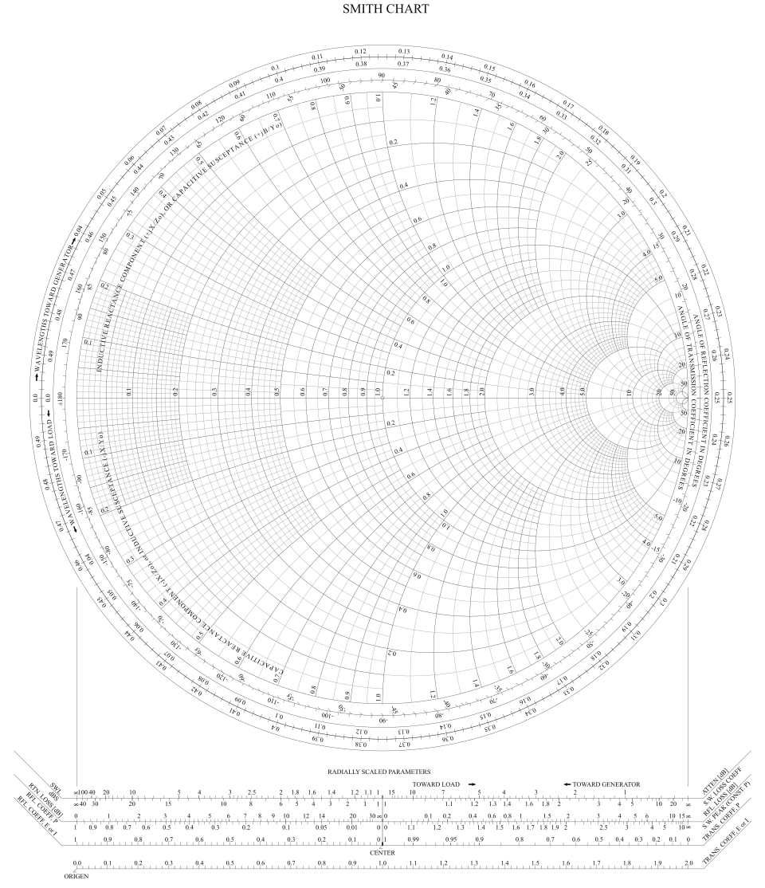

(https://en.wikipedia.org/wiki/Smith_chart#/media/File:Smith_chart3.svg)

I won’t go into too much detail, but in general, the horizontal axis of the Smith chart represents the real part of the impedance, while the full circles correspond to constant resistance values. The upper semicircles, stretching from the open-circuit point $\infty$ to the edge of the chart, represent purely inductive reactances (positive imaginary values). The lower semicircles represent purely capacitive reactances (negative imaginary values). This means that if an impedance is located in the upper half-plane, its value can be read by finding the intersection of the nearest inductive reactance circle and the nearest constant-resistance circle. The same method applies for the lower half-plane with capacitive reactances.

The Smith chart is usually normalized to $Z_0$. In terms of the reflection coefficient $\Gamma$ , this means the chart can represent all values between +1 and -1, allowing us to display the impedances of passive elements. The downside is that active elements such as transistors, operational amplifiers, signal sources or diods can not be sufficiently displayed, because coefficients $|\Gamma|$ can exceed one. And the Smith-Chart can only display reflection values where $|\Gamma| \leq 1$.

**Please note**: The number of circles on a Smith chart is actually infinite. This is why the chart appears “fragmented.” To make it practical, different regions have varying circle densities, helping the user determine the impedance of a circuit element without showing too many or too few circles. The chart was originally designed to be used with pen and paper. Today, however, VNAs can directly display the measured impedance at a selected point as a complex number, making manual interpretation largely unnecessary.

# Measurement

## Specification

### Ojective

The purpose of this measurement is to find the VSWR 2:1 bandwith of a generic telescope whip antenna at different lengths. It should be clearified if the antenna has any use for the 2m and 70cm amature radio bands.

### Equipement Used 

+ Hardware 
	 + Sysjoint NanoVNA-F V3
	 + 47cm Monopole Telescope Whip Antenna
	 + NESDR Smartee
	 + Lenovo ThinkPad X280 (Windows 11)

+ Software
	+ Sysjoint NanoVNA Saver 0.7.3
	+ SDR++

### Measurement Parameters

+ **Return Loss**
+ **VSWR**
+ **$S_{11}$**

### VNA freq. setting

+ 1.8MHz - 440MHz
	+ Sweep: 4.38MHz/step
+ 200MHz - 600MHz
	+ Sweep: 4MHz/step
+ 400Mhz - 800MHz
	+ Sweep: 4MHz/step

In all configuration minimum tracking is active. 

## Setup 

The measurement is performed on a clean kitchen table, with the NanoVNA-F V3 $S_{11}$ port connected to the monopole antenna. A USB-C cable connects the Lenovo ThinkPad X280 measurement laptop with the VNA.

Three different scenarios are are considered: 
	+ Antenna perbedicular upright to kitchen surface
	+ Antenna straight parrallel to kitchen surface 
	+ Antenna perbedicular upright over a conductive surface 

**Antenna perbedicular upright to kitchen surface**

**Antenna straight parrallel to kitchen surface**
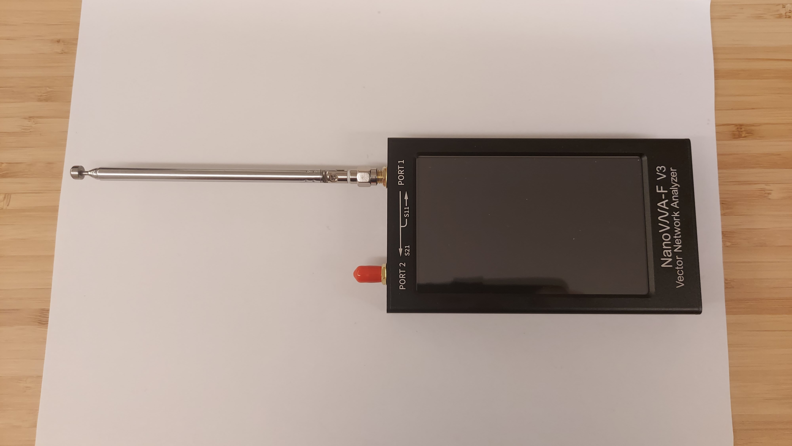

**Antenna over conductive plane**
( I wanted to do this experiment, because theory always talks about an idealized model with a infinitely large conductive groundplane beneath the monopole antenna. In practice this is almost never the case. Althgouh the metal sheet and the antenna are not connected to the same ground potential, I wanted to see, if there is any significant difference with a conductor beneath).
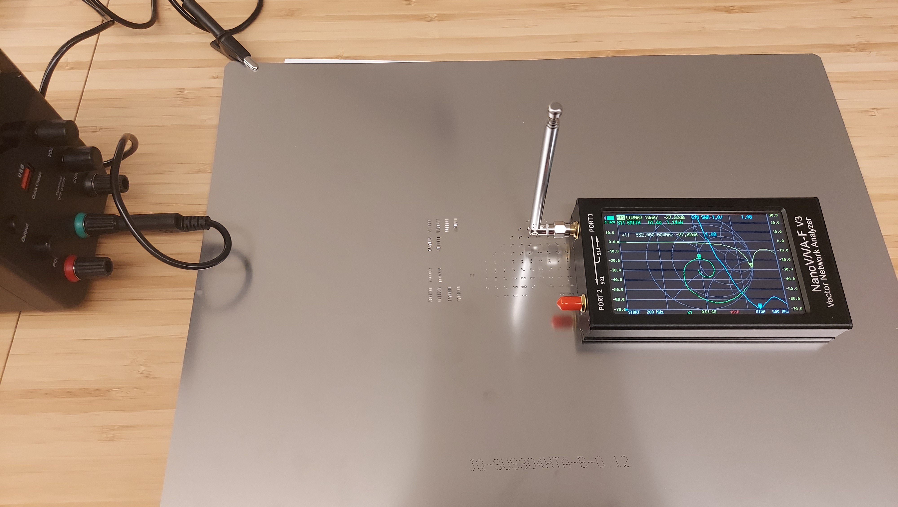

For all three scenarios SWR, Return loss, and $Z_L$ are measured at four different antenna lenghts: 11.5cm, 17.5cm, 30cm and 47cm. The length is measured form the turnable joint to tip of the antenna. 

## Data

 **Antenna perpendicular upright** 
 
| Nr. | Antenna length in cm | min. f in MHz | min. SWR | min. RL in dB | Z_L | Bandwith in MHz | f-Start in MHz | f-End in MHz |
| --- | --- | --- | --- | --- | --- | --- | --- | --- |
| 1 | 11.5 | 532 |1.52 | 13.77 | 57.8 - 21.0678i | 68 | 588 | 656 |
| 2 | 17.5 | 412 | 1.19 | 21.26 | 54.9 - 7.6495i| 104 | 372 | 476 |
| 3 | 30 | 248 | 1.32 | 17.18 | 61.1 - 10.4181i | 20 | 240 | 260 |
| 4 | 47 | 181.46 | 1.53 | 13.55 | 73 - 11.6943i | 17.52 | 172 | 190.226 |

**Antenna straight parallel to kitchen surface**

| Nr. | Antenna length in cm | min. f in MHz| min. SWR | min. RL | Z_L | Bandwidth in MHz | f-Start in MHz | f-End in MHz|
| --- | --- | --- | --- | --- | --- | --- | --- | --- |
| 1 | 11.5 | 496 | 1.21 | 20.4 | 59.6 - 4.1890i | 68 | 456 | 524 |
| 2 | 17.5 | 348 | 1.16 | 22.36 | 54.6  - 6.3964i | 48 | 348 | 396 |
| 3 | 30 | 247.19 | 1.15 | 23.14 | 44.1 + 2.9044i | 17.528 | 238.428 | 255.956 |
| 4 | 47 | 168.316 | 1.27 | 18.4 | 51.8  - 12.2009i| 13.146 | 163.93 | 177.080 | 

**Antenna perpendicular upright over a conductive surface** 

| Nr. | Antenna length in cm | min. f in MHz| min. SWR | min. RL | Z_L | Bandwidth in MHz | f-Start in MHz | f-End in MHz|
| --- | --- | --- | --- | --- | --- | --- | --- | --- |
| 1 | 11.5 | 528 | 1.10 | 26.36 | 46.9 + 3.4834i | 172 | 504 | 676 |
| 2 | 17.5 | 404 | 1.58 | 13.38 | 49.4 + 21.8049i | 36 | 380 | 416 | 
| 3 | 30 | 238.43 | 1.14 | 23.74 | 44.7 + 0.3146i | 35.06 | 220.9 | 255.94 |
| 4 | 47 | 163.934 | 1.49 | 14.11 | 33.4 + 1.0337i | 8.76 | 159.5 | 168.32 | 

**Exemplary, VNA measurement result of Antenna perpendicular upright NR. 1**
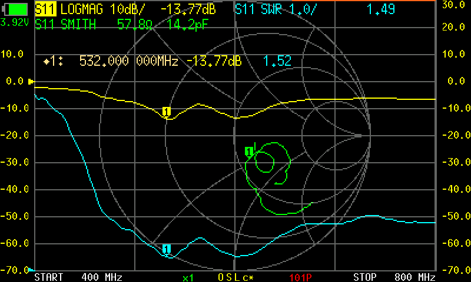

The measurement showed that the VSWR 2:1 Antenna Bandwitdh becomes more narrower for longer antenna lengths. For shorter antenna lengths the bandwith increases, but varies strongly between the different configurations. The SWR curve from the examplory measurement indicates that for other VSWR ratios the bandwidth widens significantly. 

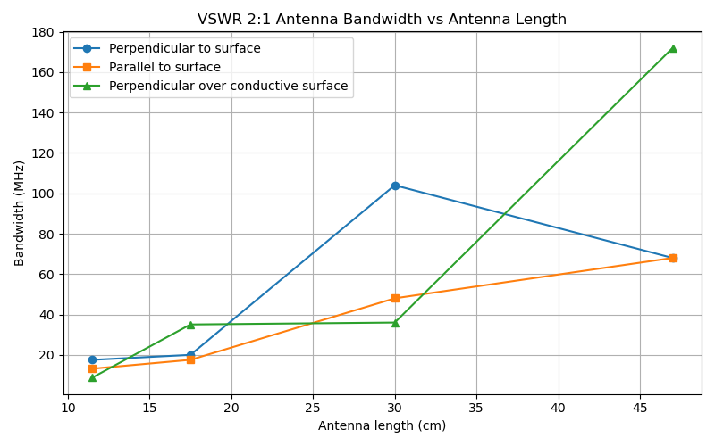

The antenna gives us a total frequency range between approximately 160MHz and 680MHz by adjusting its length. 

## Testing with FM Radio

In the measurements we determined the antenna bandwidth for different lengths. Lets see, how this affects our operation when we are listening to radio signals. Therefore I use a USB Software Defined Radio (SDR) in combination with SDR++ Software to listen to radio signals.

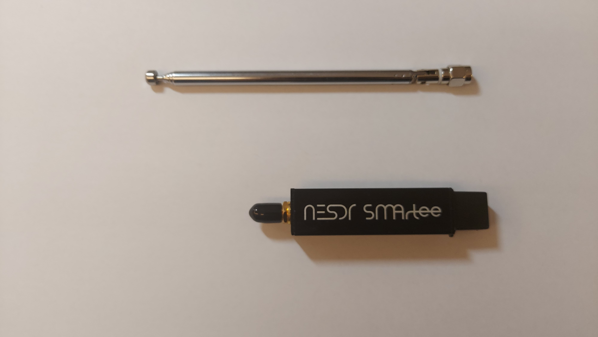

As so often, there ws no activity in the 70cm and 2m band during my test and no beacon transmitter nearby, but I captured radio signals from the FM-band with an antenna length of 47cm, even if the actual VSWR 2:1 ratio does not include the FM-band. 

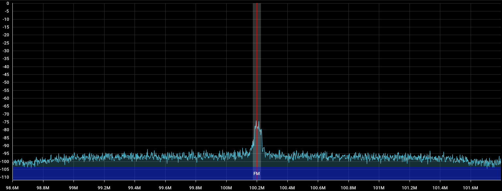

Although if the antenna is only at 11.5cm length the signal almost disappear completely. 
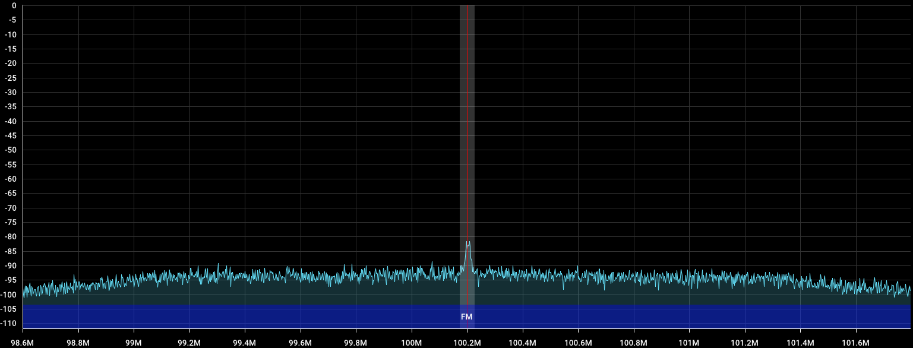

# Conclusion

In this experiment, we demonstrated how to perform an SWR measurement to determine the bandwidth of a monopole antenna.

The results showed that the antenna is reasonably well matched over a frequency range from 160 MHz to 680 MHz. Based on this bandwidth, the antenna is primarily suitable for receiving signals in the 2 m and 70 cm amateur radio bands. In practice, however, it is still possible to receive and process signals outside this range, such as in the FM band.

The SWR indicates how well an antenna is matched to a receiver or transmitter. A low SWR corresponds to efficient power transfer to the receiver. However, SWR alone does not indicate how sensitive an antenna is at receiving signals or how efficiently it radiates power. Other factors, such as the receiver’s input sensitivity, the gain of a low-noise amplifier, and environmental noise, also play a role. This explains why it is possible to receive FM radio even when the antenna’s VSWR exceeds 2. Once the SWR approaches 100 or higher, it is safe to assume that reliable transmission or reception at those frequencies is no longer possible.

The most important takeaway is that SWR is only one measure of antenna performance. Other parameters—such as gain, directivity, and the radiation pattern are equally important. In many cases, self designed antennas must be tested in an anechoic chamber to verify their transmission characteristics.

When using this monopole antenna for transmitting, it is important to be aware of its broad bandwidth behavior at higher frequencies. The source signal should be low in noise to avoid transmitting outside the intended frequency band and violating band allocations. Harmonics may also be efficiently radiated by this antenna, which should be considered in its use.

Finally, the surrounding geometry and orientation of the antenna do influence its performance, although the effect of the conductive plane beneath the antenna is relatively limited. This antenna is suitable for receiving signals in the 2 m and 70 cm bands. For transmitting, however, it is strongly recommended to use a preselect bandpass filter to ensure signals remain within the intended frequency band.

**Thank you for reading.** 

# References

[1] Joseph J. Carr, George W. Hippisley, Karl F. Warnick **Practical Antenna Handbook Sixth Edition** MacGrawHill , 2025.

[2] Sophocles J. Orfanidis **Electromagnetic Waves and Antennas** 2016

[3] Wikipedia, *Monopole antenna*. https://en.wikipedia.org/wiki/Monopole_antenna

[4] Wikipedia, *Smith-Chart*. https://en.wikipedia.org/wiki/Smith_chart
